```{r setup, include=FALSE}
options(htmltools.dir.version = FALSE)
```

class: title-slide, center, middle

# Taxonomic Enrichment Analysis with Isometric Log Ratios  

## Quang P. Nguyen 

### Advisors: Anne G. Hoen & H. Robert Frost

### Department of Epidemiology & Biomedical Data Science
### Dartmouth College

---

# Microbiome plays an important role in development 
.pull-left[.center-left[  
- The microbiome defined as the collective genomes of the microbes (composed of bacteria, bacteriophage, fungi, protozoa and viruses) that live inside and on the human body. [1]    
- Studies have shown associations between changes in the composition of the microbiome and exposures/health outcomes in early life [2]  
]]
.pull-right[
```{r, echo=FALSE, out.width="95%", fig.cap="Backhed et al. 2015"}
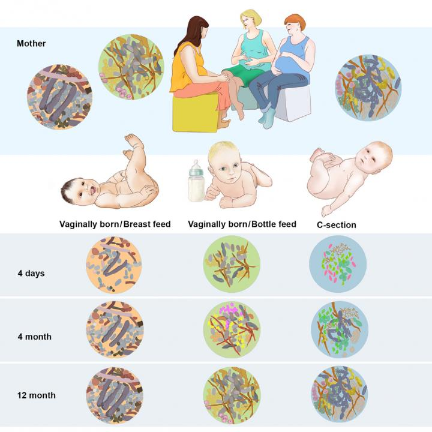

```
]


.footnote[
  [1] genome.gov   
  [2] Arrieta et al. 2014      
]
---
# Multi-omics approaches to study the microbiome  
.center[.middle[
```{r, echo=FALSE, out.width="100%"}
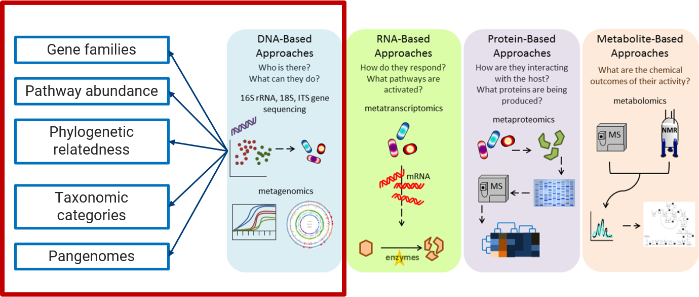
```
]]

---
# Microbial compositions are highly dynamic  

.center[
```{r, echo=FALSE, out.width = "50%", fig.cap="Stewart et al. 2018"}
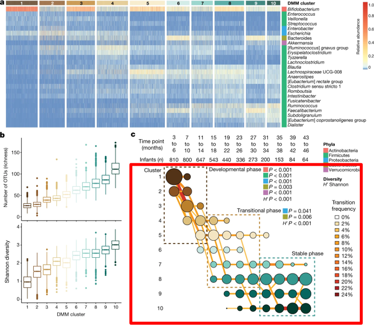

```

]

---
# Taxa-function relationships 
.pull-left[.center-left[
- Taxa-function relationships describe the distribution of functional roles across different taxonomic components [1]  

- Studies found complex ecological factors (such as nice partitioning and functional redundancy), affect the overall role of each taxa in shaping the host-microbe interaction [2]
]]
.pull-right[.center-right[
```{r, echo=FALSE, out.width= "100%", fig.cap = "Eng & Borenstein. 2018"}
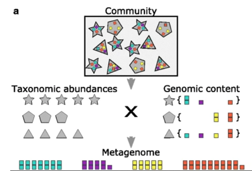
```
]]
.footnote[
[1] Eng & Borenstein 2018  
[2] Vieira-Silva et al. 2016
]

---
# Towards functionally aware taxonomic analysis   
.center[
```{r, echo=FALSE, out.width = "60%"}
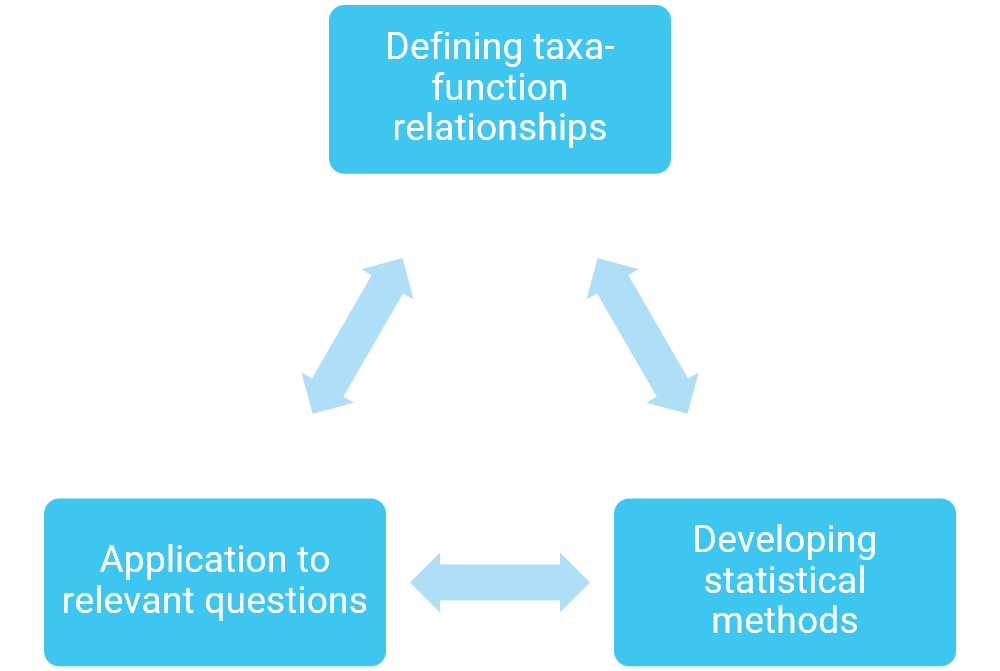
```
]

---
# Variable aggregation   
.pull-left[.center-left[
- Variable aggregation provide a way to group taxa by their common function  
- Aggregating variables can address issues of compositionality, high dimensionality, interpretability, and sparsity.  
- Traditional categories of aggregation in microbiome analyses are to higher taxonomic levels.  
]]

.pull-right[
```{r, echo=FALSE, out.width="80%"}
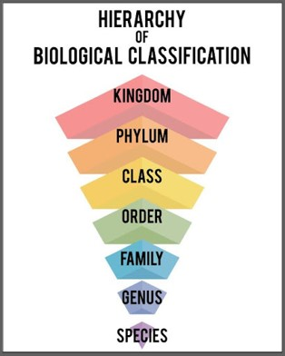
```

]

---
# Isometric log-ratio transformation  

.pull-left[
- All sequencing data (and especially microbiome) are **compositional**!  
  - Analyses should only be performed using **ratios between variables**    
  - Common transformations include the centered log ratio or the additive log ratio  

- The isometric log ratio transformation is a natural way to aggregate compositional variables  
$$X_{R/S} = \sqrt{\frac{rs}{r+s}} \log \frac{g(R_i)}{g(S_i)}$$  
  - Intuitively, if members of set $R$ increases geometrically by a factor $\alpha$ while member of set $S$ is set to be constant, then the coordinate will change by addition of $\sqrt{\frac{rs}{r+s}} \log(\alpha)$    

]

.pull-right[.center-right[
```{r, echo=FALSE, out.width = "80%", fig.cap="Source: stackoverflow"}
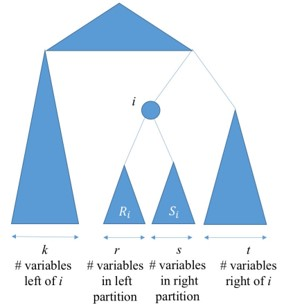
```
]]

---
# cILR: Competitive isometric log-ratio transform
.center[
Competitive null hypothesis: the abundance of taxa within the set is not enriched compared to those outside of the set 

```{r, echo=FALSE, out.width = "40%"}
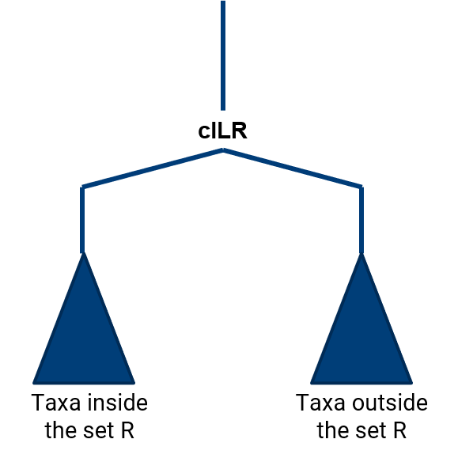
```
]

---
# Workflow  
.center[
```{r, echo=FALSE, out.width = "50%"}
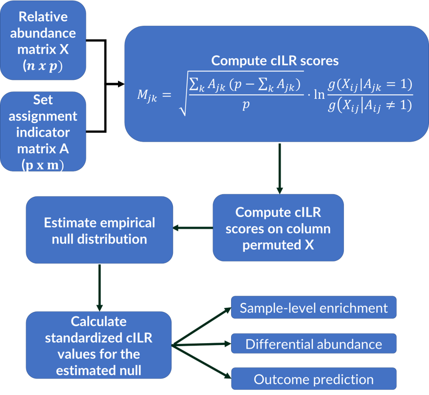
```
]  


---
# Simulation Design  
.center2[
- We assumed that the distribution of microbiome counts follows a zero-inflated negative binomial distribution [1]  
$$X_{ij} = \bigg\{\begin{array}{cc}0&\text{with probability }p_{ij}\\NB(\mu_i,\gamma_i)& \text{with probability } (1 - p_{ij}) \end{array}$$
- To incorporate flexible correlation structures, we utilized the NorTA (Normal to Anything) approach [2]  
Given an $n$ by $p$ matrix of values $U$ sampled from multivariate normal distribution with correlation matrix $\rho$, we can generate target microbiome count vector $X_i$ for taxa $i$ following distribution $P$ characterized by the cumulative distribution $\mathbb{F}$:  
$$X_i = \mathbb{F}^{-1}(\Phi_{U_i})$$
where $\Phi_{U_i}$ represent samples from the standard multivariate normal distribution.  ]

.footnote[
[1] Calgaro et al. 2020    
[2] Cairo et al. 1997  
]


---
# Null distribution for significant testing    

.pull-left[
```{r, echo=FALSE, out.width = "90%", fig.cap = "Distribution fitting using null data from Human Microbiome Project"}
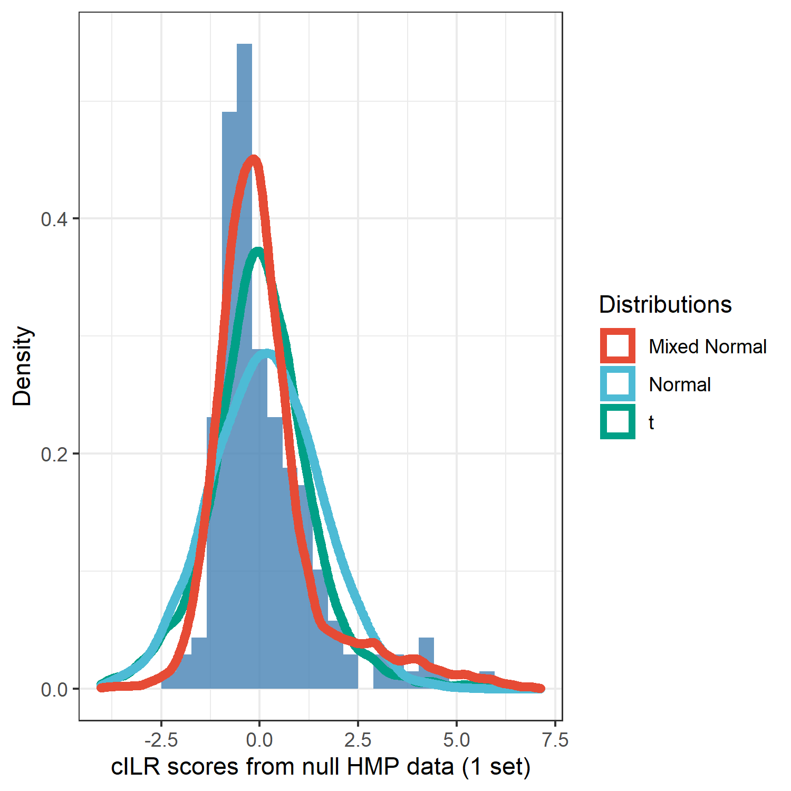
```
]
.pull-right[
.center-right[
```{r,echo=FALSE, out.width = "120%", fig.cap = "Kurtosis and Skewness from simulated data"}
knitr::include_graphics("../manuscript/figures/kurtosis_skewness_sim.png")

```

]]

---
# Adjusting for inter-taxa correlation  
.pull-left[.center-left[
- However, permuting taxa disrupts the natural correlation structure, leading to underestimation of the variance of the permuted null.    
- Existing methods in the gene set testing literature accounts for this by estimating a variance inflation factor (VIF) [1]   
- Estimate this variance inflation by using the **estimated variance of the test statistic under unpermuted data**    
<!--
```{r, echo=FALSE, out.width = "60%"}
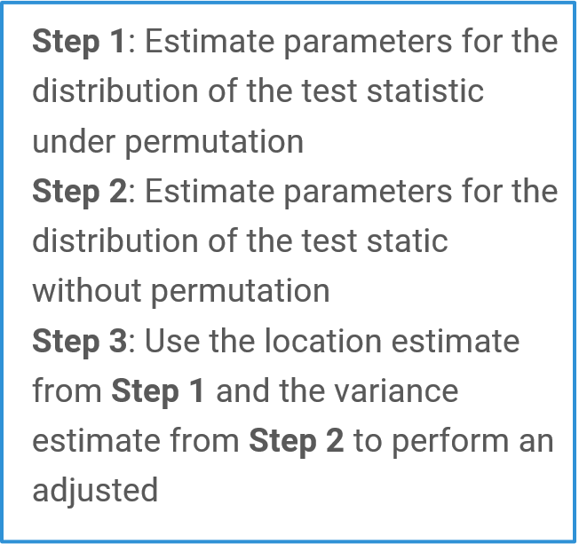
```
-->
]]

.pull-right[.center-right[
```{r, echo=FALSE, fig.cap="Simulations under the global null"}
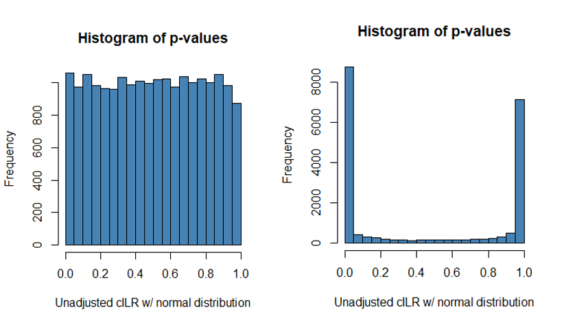
```
]]

.footnote[
[1] Wu & Smyth, 2012
]

---
# Goodness of fit  
.center[
```{r, echo=FALSE, out.width="45%"}
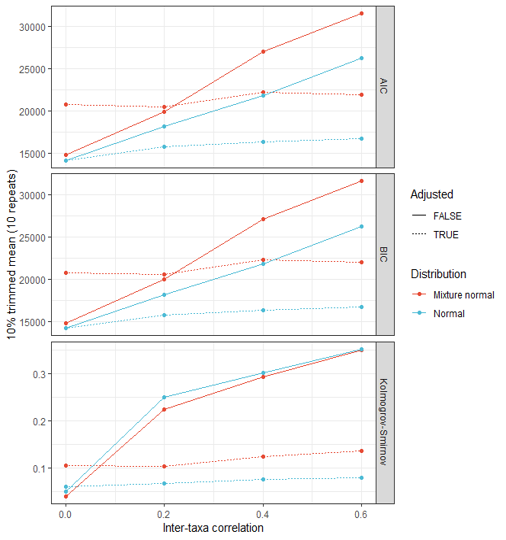
```
]

---
# Preliminary results  
.huge[
- We evaluated our method for three primary tasks:  
  - Single-sample significance testing  
  - Disease prediction  
  - Differential abundance analysis   
- Parametric simulations using the zero-inflated negative binomial distribution. We varied inter-taxa correlation (assumed to be exchangable), added sparsity, set size and effect size where appropriate  
- Real data evaluation  
]

---
# Single-sample significance testing   
.center[.middle[
```{r, echo=FALSE}
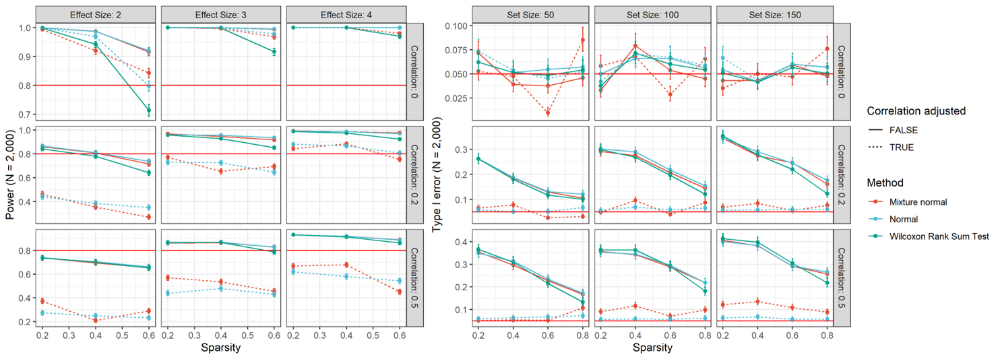

```
]]

---
# Single-sample significance testing  
.center[.middle[
```{r, echo=FALSE, out.width = "60%"}
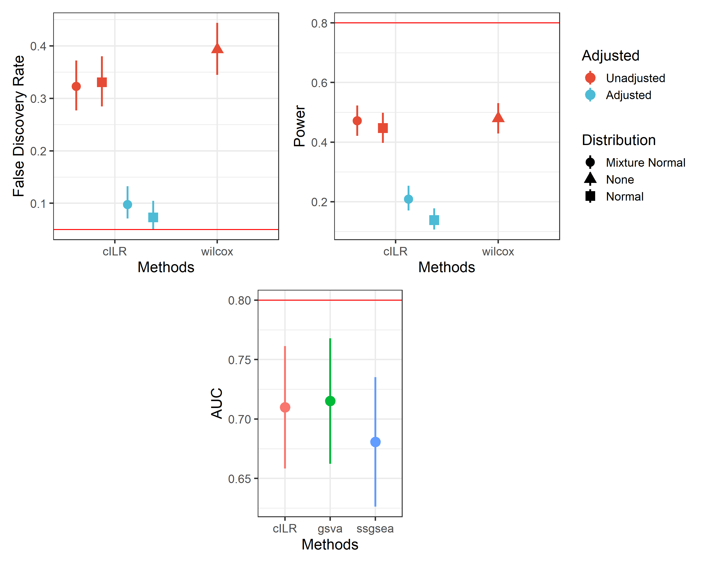
```
]]
---
# Next steps  
.center2[.huge[
- Continue to refine our statistical model, including expanding to multiple-sample hypothesis testing, and variance inflation estimation procedure especially for mixture distributions  
- Evaluate model in all three outlined tasks across both parametric simulations and real data implementations ]]

---
# Acknowledgements  

.pull-left[
  **Thesis Advisors**  
  Anne G. Hoen, PhD    
  H. Robert Frost, PhD   
  **Thesis Committee**  
  Margaret R. Karagas, PhD  
  Brock C. Christensen, PhD  
  **Hoen Lab**  
  Weston Viles, PhD  
  Modupe O. Coker, PhD  
  Jie Zhou, PhD  
  Rebecca Lebeaux  
  Erika Dade  
  **Frost Lab**  
  Xingyu Zheng  
  Courtney Schiebout  
  **Research Funding Sources**  
  NLM R01LM012723 (AGH)  
  NLM K01LM012426 (HRF)  

]

.pull-right[
  **New Hampshire Birth Cohort Study**   
  Margaret K. Karagas, PhD (PI)  
  Juliette C. Madan, MD  
  All staff and participants  
  **UNC Metabolomics and Exposome Core**  
  Susan Sumner, PhD  
  Susan McRitchie, MS  
  Wilmal Pathmasiri, PhD  
  **Marine Biological Laboratory**  
  Hillary Morrison, PhD    
  **QBS Administration**  
  Diane Gilbert Diamond, ScD  
  Scott Gerber, PhD  
  Rosemary A. White  
  Shaniqua A. Jones  
  Kristine A. Griffin, PhD  
]


